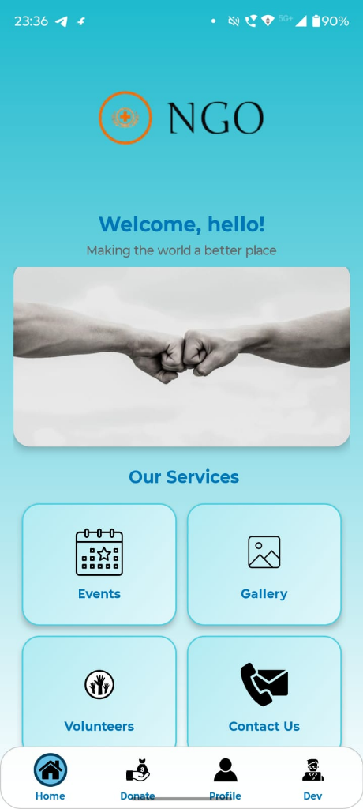
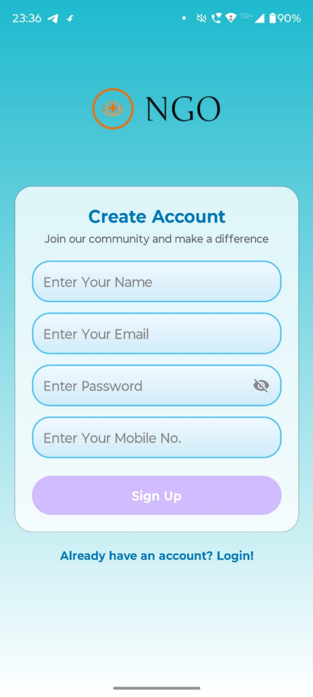
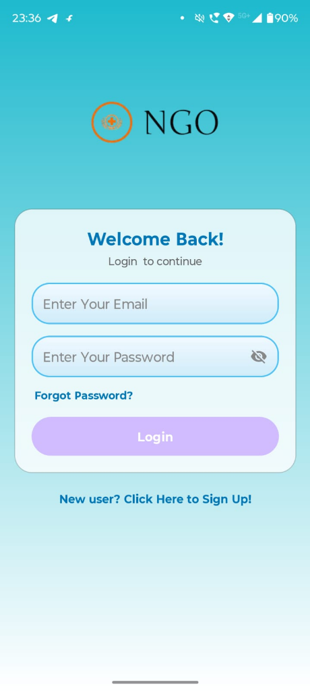

# 🤝 NGO App

A comprehensive Android application for NGO (Non-Governmental Organization) management that connects donors, volunteers, and administrators on a single platform.

## Features

### User Features
- **Authentication** — Email/Password & Phone OTP login with Firebase Auth
- **Donations** — Dummy payment flow with amount selection
- **Volunteer Registration** — Join as a volunteer for NGO activities
- **Events** — View upcoming NGO events and activities
- **Gallery** — Browse NGO photos and media
- **Feedback** — Submit feedback and suggestions
- **Contact Us** — Get in touch with the NGO team
- **Profile** — View and manage user profile

### Admin Features
- **Admin Dashboard** — Centralized control panel
- **User Management** — View all registered users
- **Donation Tracking** — Monitor all donations
- **Event Management** — Add and manage events with images
- **Message Center** — View contact queries, feedback & volunteer requests
- **Gallery Management** — Upload and manage photos

## Screenshots

  
  &nbsp;&nbsp;
  
  &nbsp;&nbsp;
  

## Tech Stack

| Technology | Usage |
|------------|-------|
| **Java** | Primary language |
| **Android** | Platform (API 24+) |
| **Firebase Auth** | Email/Password & Phone authentication |
| **Firebase Realtime Database** | Data storage for users, donations, events, gallery, feedback, etc. |
| **Glide** | Image loading and caching |
| **Dummy Payment** | Simulated donation payment flow |

## Installation

1. Clone the repository
2. Open in Android Studio
3. Create a Firebase project at [console.firebase.google.com](https://console.firebase.google.com)
4. Enable **Email/Password** and **Phone** authentication in Firebase
5. Download your `google-services.json` and place it in the `app/` folder
6. Set your admin credentials in `login.java` (replace the `TODO` placeholders)
7. Build and run on Android device/emulator

## Requirements

- Android Studio Arctic Fox or later
- Minimum SDK: API 24 (Android 7.0)
- Target SDK: API 35 (Android 15)
- Java 11

